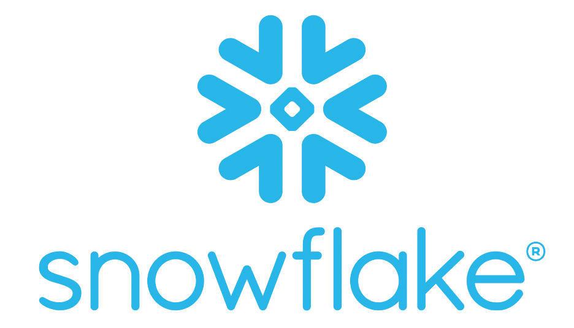
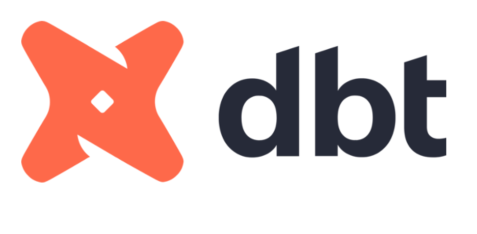
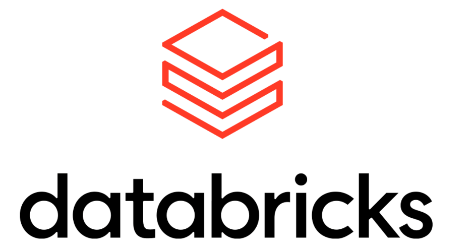
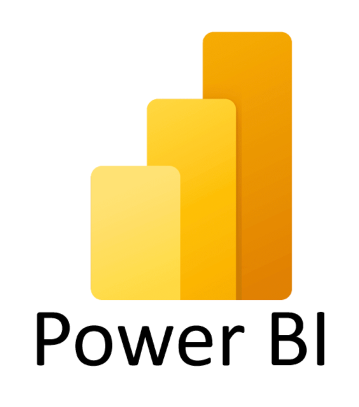

<h1 align="center">A Data Engineer & Analytics Enthusiast!</h1>

  “Every dataset has its own rhythm ,I just enjoy tuning in until the story becomes clear.”

  <!-- Replace with your image -->
  

---
<h2 align="center">📘 About Me</h2>

📊 I enjoy turning messy data into clear, meaningful stories. Numbers feel like quiet puzzles to me , pieces that reveal meaning when placed thoughtfully. Whether I'm shaping a modern data stack, training a model, or building a Streamlit app, I enjoy the mix of logic, design, and curiosity that data work demands.

✨ I believe good analytics isn’t just about accuracy. It’s about stories, clarity, and decisions that lead to better understanding. That’s why I gravitate toward projects where engineering meets insight - pipelines that feel smooth, dashboards that feel intuitive, and models that feel honest.

🧠 I explore data engineering, analytics, ML, and cloud tools with a maker’s mindset: build, refine, simplify, repeat. Tools change - the excitement of learning doesn't.

💛 **Fun fact:** True to my name **Rhythm** I aim to remain well-tuned, calm, and composed in everything I do.

☕ Outside the tech bubble, you'll find me reading, exploring vegetarian cooking, or working through ideas away from the screen.

---

<h2 align="center">⚙️ Technologies & Tools</h2>

  <!-- Programming -->
  
  

  <!-- Cloud -->
  
  
  
  
  

  <!-- Data Engineering -->
  
  
  

  <!-- Analytics / BI -->
  
  

  <!-- Databases -->
  

  <!-- Productivity -->
  
  

---

<h2 align="center">🚀 Project Portfolio </h2>

---

### 🧠 Data Engineering / Machine Learning / Cloud Analytics Projects  

| Project | Description |
|--------|-------------|
| [**vendor_data_pipeline**](https://github.com/rhythm-billore/vendor_data_pipeline) | A scalable end-to-end data ecosystem built on GCP, designed to process multi-source data and deliver real-time, analysis-ready outputs. The pipeline uses Cloud Storage, Pub/Sub, Cloud Functions, Dataflow, Composer, and BigQuery to automate ingestion, transformation, and trend analysis. Delivered with an interactive dashboard enabling deep insights into sales trends and customer behavior.|
| [**yelp_recommendation_system**](https://github.com/rhythm-billore/yelp_recommendation_system) |A customer-oriented restaurant recommendation engine that uses TF-IDF, cosine similarity, and user-preference vectors to surface the most relevant places for each individual. Delivered with an interactive Streamlit UI featuring tailored suggestions, cuisine patterns, and exploratory insights. |
| [**netflix_azure_data_engineering_project**](https://github.com/rhythm-billore/netflix_azure_data_engineering_project) |Azure-based data engineering project using Data Factory, ADLS, and SQL to build a reproducible ingestion and transformation pipeline for Netflix-themed datasets. Showcases linked services, pipelines, mapping flows, and query-ready outputs.|
| [**user_email_management**](https://github.com/rhythm-billore/user_email_management) | A containerized email-management dashboard built with Streamlit, featuring structured storage, parsing, and analysis of user email activity. The app and SQL database run as independent Docker containers and are orchestrated on Kubernetes using Deployments, Services, and ConfigMaps, enabling reliable communication, scaling, and modular deployment.|
| [**mental_health_counselor_guide**](https://github.com/rhythm-billore/mental_health_counselor_guide) |A Streamlit-powered guidance portal that analyzes counselor notes using ML emotion detection and LLM-generated insights, providing real-time, context-aware suggestions through a simple and intuitive interface.|

---

  Thankyou for visiting! 😊

